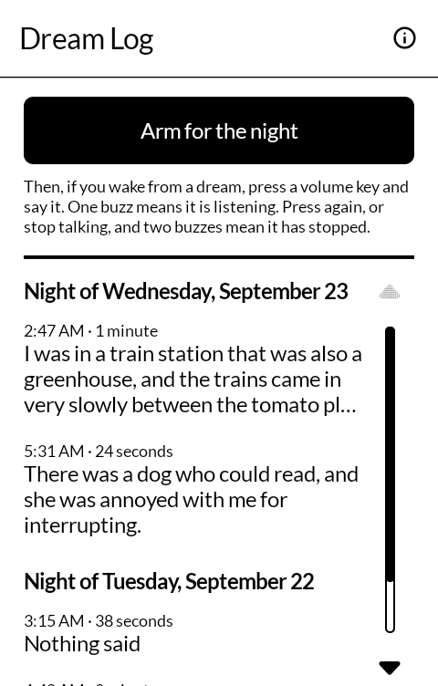
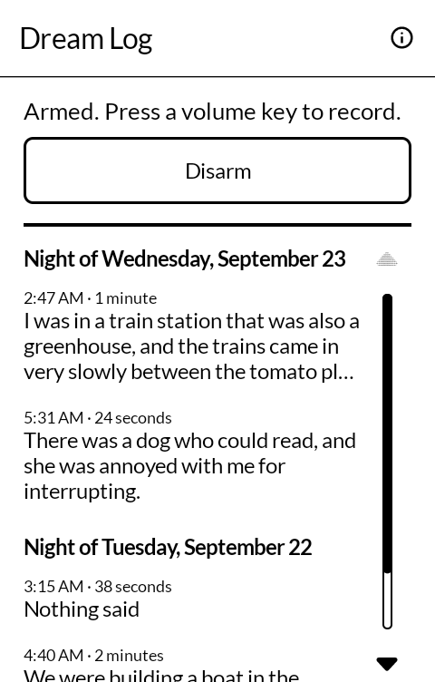
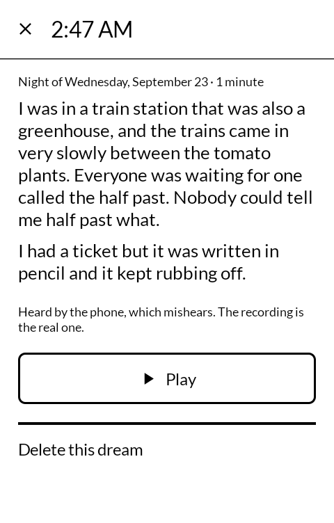
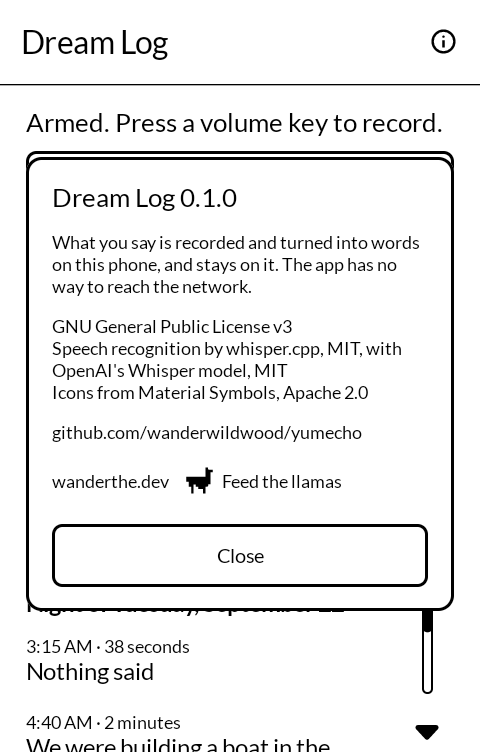

# 夢帳 yumechō — Dream Log

Arm it before you sleep. If you wake from a dream, press a volume key without looking and say
what you saw. In the morning it is written down. Built for the
[Mudita Kompakt](https://mudita.com/products/kompakt/) and its E Ink screen.

*Yumechō* is 夢帳, a dream notebook: the one kept by the bed, which nobody can find a pen for
at four in the morning.

Not a fork. Written from scratch in Kotlin and Jetpack Compose, using Mudita's own
[MMD](https://github.com/mudita/MMD) design system, with speech recognition by
[whisper.cpp](https://github.com/ggml-org/whisper.cpp) running on the phone itself.

| | |
|---|---|
|  |  |
|  |  |

## Where this is up to

Version 0.1.2. Every screen has been driven on an emulator, and the speech recognition has
been timed on a Kompakt: a minute of speech takes about half a minute to write down.

## How it works

- **Armed**, it waits with the screen off and the phone locked. Nothing lights the screen and
  nothing unlocks it.
- **A volume key** starts a recording: one buzz. Press again and it stops: two buzzes. If you
  say your dream and fall back asleep, it stops by itself after twenty seconds of quiet.
- **Afterwards**, while you sleep, the phone listens to the recording and writes down what it
  heard. A recording with nothing in it louder than the room is marked as nothing said rather
  than handed to the recogniser, which, given silence, invents a polite "Thank you."
- **In the morning** the log shows each night's dreams, and each one keeps its recording. The
  phone mishears, especially someone half asleep, and the recording is the real one.
- It disarms itself after twelve hours.
- **To write them up**, "Save the words to a file" at the foot of the log saves every dream in
  one Markdown file, oldest night first, to copy to a computer. The recordings stay on the
  phone.

- **Kept in Notes**, if you turn on "Keep dreams in Notes" behind the cog: each dream's words
  also become a Markdown note in a `Dreams` folder of [Notes](https://github.com/wanderwildwood/oboegaki),
  named for when the recording began ("Dreams/2026-10-05 0712.md"), so they sync wherever
  Notes syncs, turn up in its search, and open in any Markdown editor. A deleted dream's note is
  deleted too. The recordings are not copied. Notes takes them only from the released Dream
  Log, and Dream Log asks Notes before it turns the setting on.
- **The words can be looked up.** A dream's words are selectable, and the menu over them has
  Define, from the Dictionary, behind its ⋮.

That is the only setting.

### Why a volume key

It is the one button you can find in the dark without looking, and the only one Android lets an
app hear with the screen off. To hear it, the app plays silence while armed, which makes it the
thing the volume keys belong to, and puts the volume back after every press so a night of
dreams does not walk it to the bottom.

## Permissions

`RECORD_AUDIO`, to record. The recognition runs on the phone, and nothing it hears leaves it.
`INTERNET`, only to download the listening model for a language other than English, when one
is chosen in the settings; in English the app never goes online. With "Keep dreams in Notes" on, the
words are handed to Notes on the same phone, and Notes syncs them if it has been set up to. The details, and how to check them
rather than take them on trust, are in [PRIVACY.md](PRIVACY.md).

## Size

Almost all of the APK is the speech model, `ggml-base.en-q5_1` (57 MB, English only).
Choosing another language in the settings (Czech, Danish, Dutch, Finnish, French, German,
Italian, Norwegian, Polish, Portuguese, Spanish, Swedish) downloads the multilingual
`ggml-base-q5_1` (60 MB) once; choosing English again deletes it. On a
Kompakt it wrote 55 seconds of speech down in 28, with punctuation. The smaller `tiny.en` was
quicker on a short clip but left out the punctuation, and a dream is hard enough to read back
already.

## Building

```
sh models/fetch.sh        # downloads the model and checks it by hash
./gradlew assembleDebug
```

A release build is signed only when a key is present in `signing/`. There is no fallback key:
without one, `assembleRelease` produces an unsigned APK that will not install anywhere.

## Contributing

Issues and pull requests are welcome. The things that would help most:

- **Reports from real nights.** Whether the key was heard with the screen off, whether the screen
  stayed dark, whether the words were anything like what you said.
- **Other devices.** It should run on any Android 12 or later phone, but it has only been seen
  on one.
- **Other languages.** How well it hears yours, if it isn't English.

## Licence

GNU General Public License v3.0 only. Copyright wander wildwood.

Bundled, under their own licences:

- [whisper.cpp](https://github.com/ggml-org/whisper.cpp) v1.9.4, MIT, in
  `app/src/main/cpp/whisper.cpp`, trimmed to the parts an Android CPU build compiles
- OpenAI's [Whisper](https://github.com/openai/whisper) model, MIT, as converted by the
  whisper.cpp project
- Icons from [Material Symbols](https://fonts.google.com/icons), Apache 2.0
